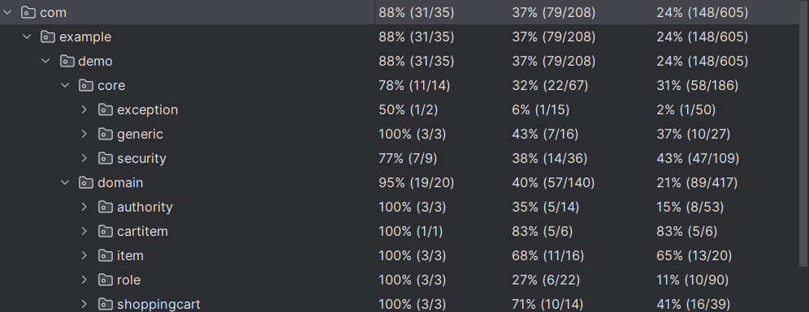

# PONGO TECH
## Project setup
### Prerequisites
- Docker Desktop
- VSCode
- Intellij

### Frontend
Clone the project to your local environment. Then, in the "M450frontend" folder, run the following command to install all packages and dependencies for the project: ```yarn install```. 

After the installation, start the app by running the command ```yarn start``` in the terminal.

### Backend & Database
Clone the project to your local environment. Then, before trying to run the backend app, start up Docker Desktop and run the following command in your terminal in the "M450backend" folder where the ```docker-compose.yml``` file is located to start the database container: ```docker-compose up -d```

After starting the database container, open the "M450backend" project in Intellij and run the app with the ```bootRun``` option or the main class ```DemoApplication```. 

### CI/CD

Can be viewed in Actions Tab

### Code Coverage JUnit 5

  

### Documentation Project

Is located in the root Folder.

<object data="M450_PONGO.pdf" type="application/pdf" width="100%"> 
</object>